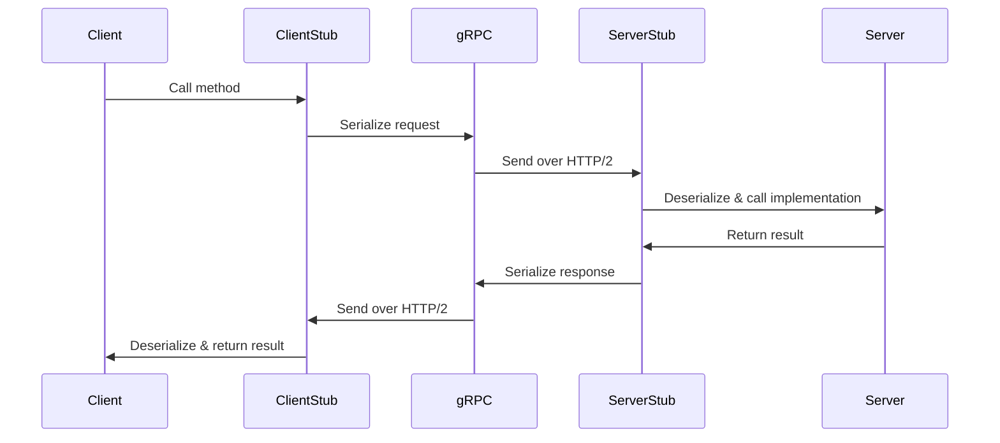
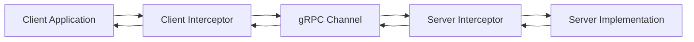
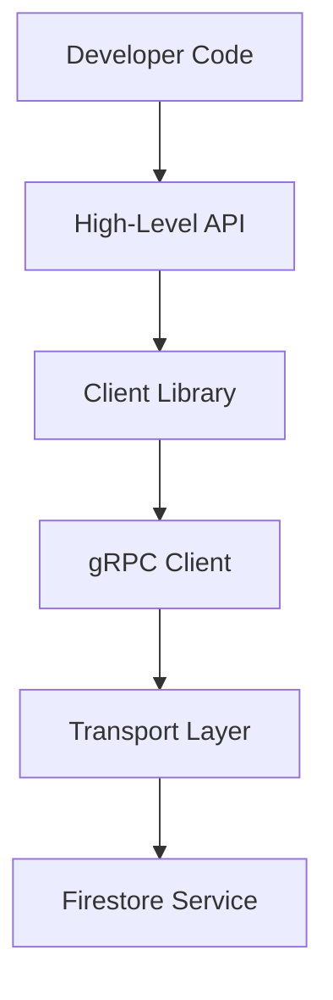
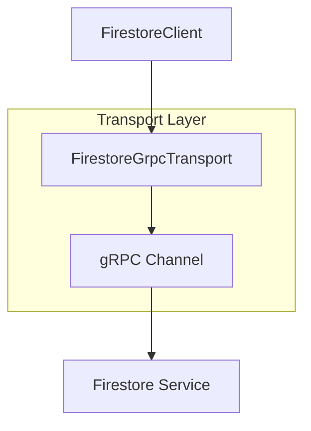
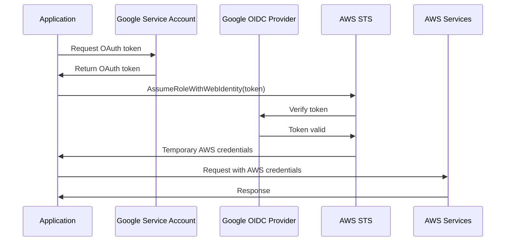
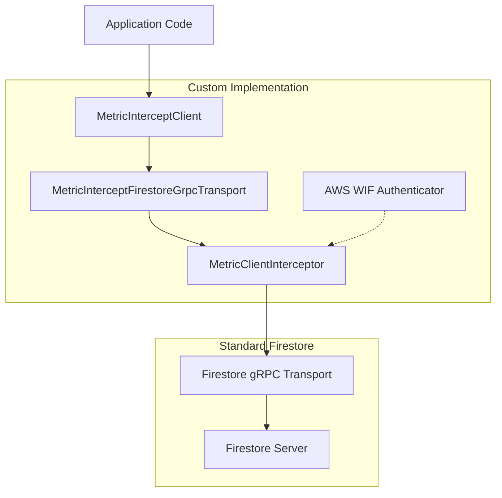
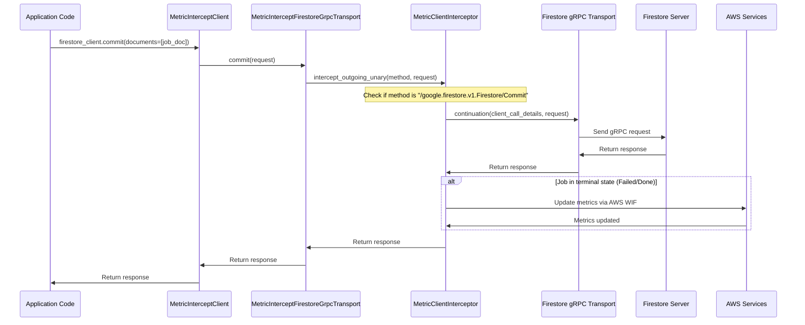

# gRPC Interception Pattern in Firestore

## Table of Contents
1. [Introduction](#introduction)
2. [gRPC Overview](#grpc-overview)
   - [What is gRPC?](#what-is-grpc)
   - [Key Features of gRPC](#key-features-of-grpc)
   - [gRPC Architecture](#grpc-architecture)
   - [gRPC Interceptors](#grpc-interceptors)
3. [Firestore and gRPC](#firestore-and-grpc)
   - [Firestore's gRPC Implementation](#firestores-grpc-implementation)
   - [Firestore Client Architecture](#firestore-client-architecture)
   - [Transport Layer in Firestore](#transport-layer-in-firestore)
4. [Custom gRPC Interception Pattern in PR #279](#custom-grpc-interception-pattern-in-pr-279)
   - [Overview](#overview)
   - [Key Components](#key-components)
   - [Implementation Details](#implementation-details)
   - [AWS Workload Identity Federation Integration](#aws-workload-identity-federation-integration)
5. [Benefits and Considerations](#benefits-and-considerations)
   - [Benefits](#benefits)
   - [Performance Considerations](#performance-considerations)
   - [Maintenance Considerations](#maintenance-considerations)
   - [Security Considerations](#security-considerations)
6. [Example Use Case](#example-use-case)
7. [Diagram Overview](#diagram-overview)
8. [Conclusion](#conclusion)

## Introduction

The gRPC interception pattern implemented in PR #279 represents a sophisticated approach to tracking job metrics for Firestore operations. This documentation provides a comprehensive overview of gRPC as a technology, how Firestore leverages gRPC, and the custom interception pattern implemented in the project.

## gRPC Overview

### What is gRPC?

gRPC (Google Remote Procedure Call) is a high-performance, open-source universal RPC (Remote Procedure Call) framework developed by Google. It enables client and server applications to communicate transparently and build connected systems. For more details, see the [gRPC Documentation](https://grpc.io/docs/).

gRPC uses HTTP/2 as its transport protocol and Protocol Buffers (protobuf) as its interface definition language (IDL) and underlying message interchange format. This combination provides a highly efficient, language-agnostic framework for service-to-service communication. The official [gRPC Concepts documentation](https://grpc.io/docs/what-is-grpc/core-concepts/) provides a comprehensive overview of these core concepts.

### Key Features of gRPC

1. **Strong Typing**: gRPC uses [Protocol Buffers](https://protobuf.dev/overview/) to define service contracts and message structures, providing strong typing across languages.
2. **Bidirectional Streaming**: gRPC supports [bidirectional streaming](https://grpc.io/docs/what-is-grpc/core-concepts/#bidirectional-streaming-rpc), allowing both client and server to send a sequence of messages using a single TCP connection.
3. **Language Agnostic**: gRPC supports [multiple programming languages](https://grpc.io/docs/languages/) including Python, Java, Go, C++, Ruby, and more.
4. **HTTP/2 Based**: Built on [HTTP/2](https://grpc.io/docs/what-is-grpc/core-concepts/#rpc-life-cycle), gRPC enables features like multiplexing (multiple requests over a single connection), header compression, and bidirectional streaming.
5. **Pluggable Authentication**: Supports various [authentication mechanisms](https://grpc.io/docs/guides/auth/) including SSL/TLS, token-based authentication, and custom authentication mechanisms.
6. **Interceptors**: Provides middleware-like capabilities through [interceptors](https://grpc.io/docs/guides/interceptors/), allowing code execution before or after RPC calls.

For more information on interceptors, see the [gRPC Interceptors Guide](https://grpc.io/docs/guides/interceptors/) and the [Python gRPC Interceptors documentation](https://grpc.github.io/grpc/python/grpc.html#interceptors).

### gRPC Architecture

gRPC follows a client-server model as described in the [gRPC Architecture documentation](https://grpc.io/docs/what-is-grpc/core-concepts/#service-definition):

1. **Service Definition**: Services are defined in `.proto` files using Protocol Buffers, specifying methods, request types, and response types.

2. **Code Generation**: The Protocol Buffer compiler (`protoc`) generates client and server code from the `.proto` files.

3. **Client-Server Communication**: The client initiates RPC calls to the server, which processes the requests and returns responses.

4. **Transport Layer**: gRPC uses HTTP/2 as its transport protocol, enabling features like multiplexing, flow control, and header compression.



The basic flow of a gRPC call is:
1. Client calls a method on a generated stub
2. gRPC client serializes the request using Protocol Buffers
3. Request is sent to the server over HTTP/2
4. Server deserializes the request
5. Server executes the method implementation
6. Response is serialized and sent back to the client
7. Client deserializes the response and returns it to the caller

For more details on this flow, see the [RPC Life Cycle documentation](https://grpc.io/docs/what-is-grpc/core-concepts/#rpc-life-cycle).

### gRPC Interceptors

Interceptors are a powerful feature in gRPC that allow developers to intercept and modify RPC calls. They function similarly to middleware in web frameworks, enabling cross-cutting concerns like logging, authentication, monitoring, and more. The [gRPC Interceptors documentation](https://grpc.io/docs/guides/interceptors/) provides a comprehensive overview of this feature.

There are two types of interceptors in gRPC:

1. **Client Interceptors**: Execute on the client side before a request is sent to the server and after a response is received.

2. **Server Interceptors**: Execute on the server side before a request is processed and after a response is generated.



Interceptors can be used for various purposes:
- Logging and monitoring
- Authentication and authorization
- Error handling
- Request/response transformation
- Caching
- Rate limiting
- Metrics collection

In Python, client interceptors can be implemented by creating a class that inherits from `grpc.UnaryUnaryClientInterceptor`, `grpc.UnaryStreamClientInterceptor`, `grpc.StreamUnaryClientInterceptor`, or `grpc.StreamStreamClientInterceptor` depending on the type of RPC call. The [Python gRPC Interceptors API documentation](https://grpc.github.io/grpc/python/grpc.html#interceptors) provides detailed information on implementing interceptors in Python.

For example, a simple logging interceptor in Python might look like:

```python
class LoggingInterceptor(grpc.UnaryUnaryClientInterceptor):
    def intercept_unary_unary(self, continuation, client_call_details, request):
        print(f"Calling {client_call_details.method} with request: {request}")
        response = continuation(client_call_details, request)
        print(f"Received response: {response}")
        return response
```

To use this interceptor with a gRPC channel:

```python
# Create a channel with the interceptor
channel = grpc.insecure_channel('localhost:50051')
intercepted_channel = grpc.intercept_channel(channel, LoggingInterceptor())
stub = service_pb2_grpc.ServiceStub(intercepted_channel)
```

Server interceptors can be implemented similarly by inheriting from `grpc.ServerInterceptor`:

```python
class ServerLoggingInterceptor(grpc.ServerInterceptor):
    def intercept_service(self, continuation, handler_call_details):
        print(f"Received request: {handler_call_details.method}")
        return continuation(handler_call_details)
```

And used when creating a server:

```python
server = grpc.server(
    futures.ThreadPoolExecutor(max_workers=10),
    interceptors=[ServerLoggingInterceptor()]
)
```

## Firestore and gRPC

### Firestore's gRPC Implementation

Google Cloud Firestore is a NoSQL document database that uses gRPC for client-server communication. Firestore's API is defined using Protocol Buffers, and the client libraries generated from these definitions communicate with the Firestore service using gRPC. The [Firestore API Reference](https://cloud.google.com/firestore/docs/reference/rpc) provides detailed information about the gRPC API.

Firestore's gRPC API provides methods for:
- Creating, reading, updating, and deleting documents
- Querying collections
- Listening for real-time updates
- Managing transactions
- Batch operations

The Firestore service exposes these methods through a gRPC service defined in Protocol Buffer files. The client libraries, such as the [Python client library](https://cloud.google.com/python/docs/reference/firestore/latest), use these definitions to generate code that can communicate with the Firestore service.

The core Firestore gRPC service is defined in the [firestore.proto](https://github.com/googleapis/googleapis/blob/master/google/firestore/v1/firestore.proto) file, which defines methods like `GetDocument`, `ListDocuments`, `CreateDocument`, `UpdateDocument`, `DeleteDocument`, and `Commit`.

For more information on Firestore's gRPC implementation, see the [Google Cloud Firestore Documentation](https://cloud.google.com/firestore/docs) and the [Firestore RPC API Reference](https://cloud.google.com/firestore/docs/reference/rpc).

### Firestore Client Architecture

The Firestore client architecture consists of several layers, as described in the [Firestore Client Libraries documentation](https://cloud.google.com/firestore/docs/clients/libraries):

1. **High-Level API**: The top-level API that developers interact with, providing methods like `collection()`, `document()`, `get()`, `set()`, etc.
2. **Client Library**: Implements the high-level API and translates method calls into gRPC requests.
3. **gRPC Client**: Handles the communication with the Firestore service using gRPC.
4. **Transport Layer**: Manages the HTTP/2 connection and sends/receives gRPC messages.



The client library uses a gRPC transport to communicate with the Firestore service. This transport is responsible for serializing requests, sending them to the server, receiving responses, and deserializing them. The [Python Firestore Client documentation](https://cloud.google.com/python/docs/reference/firestore/latest/client) provides detailed information on the client architecture and API.

In the Python client, the transport layer is implemented in the [`google.cloud.firestore_v1.services.firestore.transports`](https://cloud.google.com/python/docs/reference/firestore/latest/google.cloud.firestore_v1.services.firestore.transports) module, which provides both gRPC and REST transport implementations.

### Transport Layer in Firestore

The transport layer in Firestore is responsible for the actual communication with the Firestore service. It handles:

1. **Connection Management**: Establishing and maintaining connections to the Firestore service.
2. **Authentication**: Adding authentication credentials to requests.
3. **Serialization/Deserialization**: Converting between Python objects and Protocol Buffer messages.
4. **Error Handling**: Handling network errors, timeouts, and other transport-level issues.

The transport layer is implemented using gRPC's client-side libraries and can be customized or extended to add additional functionality, such as interceptors for logging, monitoring, or other cross-cutting concerns.

In the Python client, the gRPC transport is implemented in the [`google.cloud.firestore_v1.services.firestore.transports.grpc`](https://cloud.google.com/python/docs/reference/firestore/latest/google.cloud.firestore_v1.services.firestore.transports.grpc) module. The transport class, `FirestoreGrpcTransport`, provides methods for creating gRPC channels, managing credentials, and executing RPC calls.



The transport layer can be customized by providing a custom transport class to the Firestore client, which is the approach used in the gRPC interception pattern implemented in PR #279.

## Custom gRPC Interception Pattern in PR #279

### Overview

The gRPC Interception Pattern introduced in PR #279 is designed to capture Firestore commit operations at the gRPC transport level, enabling metric updates for jobs in terminal states (Failed or Done). This approach ensures:

- **Robustness**: The pattern is decoupled from Firestore library changes, making it resilient to library updates.
- **Centralized Logic**: Metrics are pushed once jobs reach terminal states (Failed/Done), ensuring consistent tracking.
- **Scalability**: The pattern applies to all Firestore operations without requiring service-specific modifications.

The interception pattern works by intercepting gRPC calls at the transport level, specifically targeting the `/google.firestore.v1.Firestore/Commit` method, which is used for all write operations in Firestore. By intercepting these calls, the system can detect when jobs are updated to terminal states and trigger metric updates accordingly.

### Key Components

#### Custom gRPC Transport

**File**: `src/seomax/implementations/metric_intercept_firestore_grpc_transport.py`

The custom gRPC transport wraps the standard Firestore gRPC transport to inject interception logic. It provides a function `create_metric_intercept_firestore_grpc_transport_class` that dynamically generates a custom transport class that integrates with the `MetricClientInterceptor`.

This custom transport class extends the standard Firestore transport and overrides methods to add interception capabilities. It ensures that all gRPC calls made through the transport are intercepted and processed by the `MetricClientInterceptor`.

#### Interceptor Logic

**File**: `src/seomax/implementations/metric_client_interceptor.py`

The interceptor logic is implemented in the `MetricClientInterceptor` class, which intercepts gRPC calls to Firestore's `Commit` method. The key methods in this class are:

- `intercept_outgoing_unary`: Checks if the method is `/google.firestore.v1.Firestore/Commit` and logs the request.
- `handle_grpc_response`: Parses the response to detect job state changes and updates metrics using `JobMetricsUpdater`.

The interceptor works by examining the gRPC method being called and the response received. If the method is a Firestore commit operation, the interceptor logs the request and processes the response to detect job state changes. If a job is found to be in a terminal state (Failed or Done), the interceptor triggers a metric update using the `JobMetricsUpdater`.

#### Intercepted Firestore Client

**File**: `src/seomax/implementations/metric_intercept_firestore_client.py`

The intercepted Firestore client extends the standard Firestore client to use the custom transport. The `MetricInterceptClient` class provides a drop-in replacement for the standard Firestore client, ensuring that all Firestore operations are intercepted and logged.

This client is used by services that need to track job metrics, allowing them to continue using the standard Firestore API while benefiting from the interception capabilities.

#### AWS WIF Authentication

**File**: `src/seomax/implementations/aws_wif_authenticator.py`

The AWS Workload Identity Federation (WIF) authentication component enables authentication to AWS services using a shared service account. This is used for metric patching operations, allowing the system to update metrics in AWS services without requiring service-specific credentials.

The `AWSWIFAuthenticator` class provides methods for authenticating to AWS services using WIF, including:
- Obtaining AWS credentials using a Google service account
- Creating AWS SigV4 signatures for API requests
- Supporting both impersonated and native OAuth tokens

### Implementation Details

#### Transport Layer

The custom transport class (`MetricInterceptFirestoreGrpcTransport`) extends the standard Firestore transport and injects the `MetricClientInterceptor` to intercept `Commit` operations. This ensures that all writes to Firestore are logged and processed for metric updates.

The transport is created dynamically using the `create_metric_intercept_firestore_grpc_transport_class` function, which takes the standard transport class as input and returns a new class that extends it with interception capabilities.

#### Interceptor Workflow

The interceptor workflow consists of the following steps:

1. **Intercept Request**: The interceptor logs the gRPC request using `grpc_utils.log_grpc_request`.
2. **Process Response**: After the Firestore operation completes, the interceptor parses the response to extract job writes.
3. **Update Metrics**: If the job is in a terminal state (Failed/Done), the interceptor uses `JobMetricsUpdater` to patch metrics.
4. **Error Handling**: The interceptor catches JSON parsing errors and logs warnings for debugging.

The interceptor uses a combination of gRPC metadata and response parsing to detect job state changes and trigger metric updates. It examines the response from the Firestore service to identify documents that represent jobs and checks if they are in terminal states.

#### Configuration

The interception pattern is configured using environment variables and Terraform resources:

- **Shared Service Account**: Defined in `terraform/resources--services/accounts.tf` and used by AWS WIF authentication.
- **Environment Variables**: Added to GitHub Actions workflows for AWS WIF configuration (e.g., `AWS_WIF_CONFIG.SHARED_SA_EMAIL`).

These configuration elements ensure that the interception pattern works correctly across all services and environments.

### AWS Workload Identity Federation Integration

[AWS Workload Identity Federation (WIF)](https://docs.aws.amazon.com/IAM/latest/UserGuide/id_roles_providers_oidc.html) is a mechanism that allows workloads (like applications running on Google Cloud) to access AWS resources without requiring long-term AWS credentials. In the context of PR #279, WIF is used to authenticate metric patching operations to AWS services.

The integration with AWS WIF involves:

1. **Service Account Configuration**: A shared service account is defined in Terraform and used for AWS WIF authentication.
2. **Authentication Flow**: The `AWSWIFAuthenticator` class obtains AWS credentials using the shared service account and uses them to authenticate to AWS services.
3. **Credential Management**: The authenticator manages the lifecycle of AWS credentials, including obtaining, refreshing, and using them for API requests.



This integration simplifies cross-cloud authentication between Google and AWS, reducing the need for service-specific credentials and configuration. For more information, see the [AWS documentation on Web Identity Federation](https://docs.aws.amazon.com/IAM/latest/UserGuide/id_roles_providers_oidc.html) and the [Google Cloud documentation on Workload Identity Federation](https://cloud.google.com/iam/docs/workload-identity-federation).

## Benefits and Considerations

### Benefits

The gRPC interception pattern provides several benefits:

1. **Library Resilience**: By intercepting at the transport level, the pattern avoids dependency on Firestore library internals, making it resilient to library updates.
2. **Centralized Metric Updates**: The pattern ensures all jobs are tracked uniformly, regardless of service or method, centralizing metric update logic.
3. **Reduced Code Duplication**: The pattern avoids scattering metric logic across service-specific CRUD methods, reducing code duplication and maintenance overhead.
4. **Cross-Cloud Authentication**: The integration with AWS WIF simplifies authentication to AWS services, reducing configuration overhead and improving security.

These benefits make the pattern a robust and scalable solution for tracking job metrics in Firestore.

### Performance Considerations

The interception pattern adds some overhead to Firestore operations due to logging and metric updates. However, this overhead is minimal and is only significant for operations that involve jobs in terminal states.

To minimize performance impact, the pattern:
- Only intercepts specific gRPC methods (`/google.firestore.v1.Firestore/Commit`)
- Only processes responses for operations that involve jobs
- Only updates metrics for jobs in terminal states (Failed/Done)

These optimizations ensure that the performance impact is minimal for most operations.

### Maintenance Considerations

The interception pattern is designed to be maintainable and adaptable to changes in the Firestore library and gRPC API. Key maintenance considerations include:

1. **Future-Proofing**: The pattern is designed to adapt to changes in Firestore's gRPC API, making it resilient to library updates.
2. **Extensibility**: The pattern can be extended to support additional gRPC methods (e.g., Stream operations) if needed.
3. **Monitoring**: The pattern includes logging and error handling to facilitate monitoring and debugging.

These considerations ensure that the pattern remains effective and maintainable over time.

### Security Considerations

The interception pattern includes several security considerations:

1. **Authentication**: AWS WIF ensures secure, centralized authentication for metric patching operations.
2. **Permissions**: The shared service account must have appropriate IAM roles for Firestore and AWS.
3. **Credential Management**: The `AWSWIFAuthenticator` manages credentials securely, avoiding the need for long-term credentials.

These considerations ensure that the pattern is secure and follows best practices for authentication and authorization.

## Example Use Case

A typical use case for the gRPC interception pattern is tracking metrics for jobs that reach terminal states. For example, when a job is updated in Firestore:

```python
# Firestore commit operation (intercepted)
response = firestore_client.commit(documents=[job_doc])
```

The interceptor detects the `Commit` method, parses the response to check if the job is in a terminal state, and updates metrics in Elasticsearch using `JobMetricsUpdater` if necessary.

This ensures that metrics are updated consistently for all jobs, regardless of which service or method updates the job in Firestore.

## Diagram Overview

The following diagrams illustrate the architecture and flow of the gRPC interception pattern implemented in PR #279.

### Component Architecture



### Request Flow



This architecture ensures that all Firestore operations are intercepted and processed for metric updates. The key components and their interactions are:

1. **Application Code**: Uses the `MetricInterceptClient` to interact with Firestore.
2. **MetricInterceptClient**: A custom client that extends the standard Firestore client to use the custom transport.
3. **MetricInterceptFirestoreGrpcTransport**: A custom transport that injects the interceptor into the gRPC channel.
4. **MetricClientInterceptor**: Intercepts gRPC calls, specifically targeting the `Commit` method to detect job state changes.
5. **Firestore gRPC Transport**: The standard transport that communicates with the Firestore server.
6. **AWS WIF Authenticator**: Provides authentication to AWS services for metric updates.

For more information on implementing custom gRPC transports and interceptors, see the [gRPC Python documentation](https://grpc.github.io/grpc/python/grpc.html) and the [Google Cloud Firestore Python client documentation](https://cloud.google.com/python/docs/reference/firestore/latest).

## Conclusion

The gRPC interception pattern implemented in PR #279 provides a robust, scalable solution for tracking job metrics in Firestore. By intercepting operations at the transport layer, it ensures consistent metric updates without modifying service-specific logic. Combined with AWS WIF authentication, this pattern enhances cross-cloud integration and simplifies service account management.

The pattern demonstrates the power of gRPC interceptors for implementing cross-cutting concerns like logging, monitoring, and metrics collection. It also showcases the flexibility of the gRPC architecture and the ability to extend and customize it to meet specific requirements.

By understanding the gRPC interception pattern and its implementation in PR #279, developers can leverage similar patterns for other cross-cutting concerns, improving the modularity, maintainability, and scalability of their applications.
